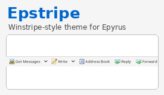

# Epstripe

**Epstripe** is a Winstripe/XP-style complete theme for [Epyrus](https://github.com/thereisonlyxul/epyrus), based on ClassicTB2 for Epyrus and refined with selected Winstripe, Thunderstripe, default Epyrus and xpDefault colored buttons assets.

The goal is to keep the classic Mozilla Thunderbird/Winstripe feeling while fitting Epyrus 2.x better than a direct old-theme transplant.



## Status

Current alpha release: **1.0.0a11**

This is an early public alpha build. The theme is already usable for visual testing, but it may still need fixes in less-used windows or dialogs.

## Compatibility

- Epyrus 2.0.0 – 2.2.*

## Highlights

- Classic Winstripe/XP-style mail toolbar icons.
- Corrected toolbar geometry based on default Epyrus behavior.
- Taller main mail toolbar for better icon spacing.
- Improved inactive selected-row readability in the folder tree and message list.
- Calendar and task toolbar icons styled through the retained xpDefault Calendar/Lightning skin layer.
- Add-on listing artwork updated with a 32×32 Get Messages-style icon.

## Known issue

In some localized Epyrus language packs, the app menu button may still display **Thunderbird** instead of **Epyrus**. The English UI already displays the correct text. This is caused by language-pack branding strings, not by the Epstripe theme.

## Installation

Install the XPI from the GitHub Releases page, or use the current packaged build in `dist/` for testing.

## Build

From the repository root:

```bash
./tools/build-xpi.sh
```

The script writes the XPI to `dist/` and runs `unzip -t` as a basic package check.

## Source and credits

Epstripe includes work derived from or inspired by several open-source Mozilla-era theme projects. See [`EPSTRIPE_SOURCE_NOTES.txt`](EPSTRIPE_SOURCE_NOTES.txt) for detailed source and contributor notes.

Main credited sources include:

- ClassicTB2 for Epyrus 2.2.0
- Default Epyrus / Mozilla theme files
- Mozilla/Thunderbird/Firefox Winstripe-era assets
- Thunderstripe 1.6 Windows Thunderbird theme
- Winstripe 1.9.9 Thunderbird development build
- xpDefault colored buttons 52.1.3

## License

Unless a file carries a more specific original notice, this package and the Epstripe modifications are distributed under the **Mozilla Public License 2.0**. See [`LICENSE`](LICENSE).

Existing file-level license headers are preserved and prevail where present.
